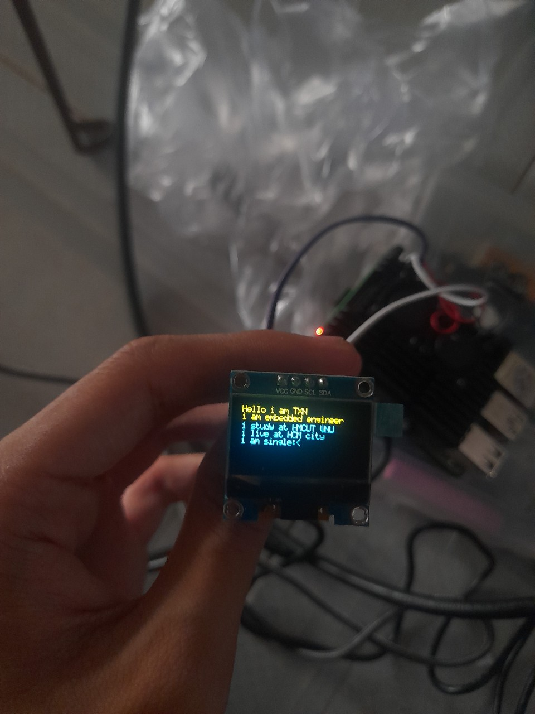
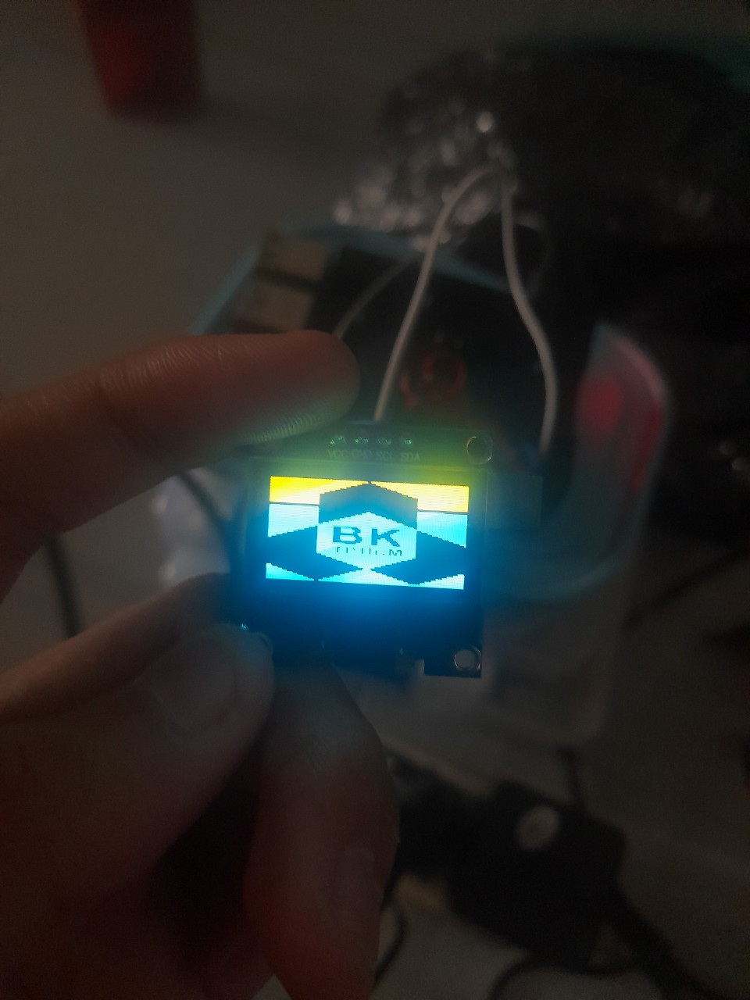

## Introduction

The SSD1306 OLED display is a compact and versatile display module used in various projects to display text and graphics. This guide explains how to interface an SSD1306 OLED display with a Raspberry Pi 4 and control it using Python.

## Requirements

- **Hardware:**
  - Raspberry Pi 4
  - SSD1306 OLED display module
- **Software:**
  - Raspberry Pi OS (latest version)
  - Python 3
  - Open Cv

## Hardware Setup

- **Connect the SSD1306 to the Raspberry Pi:**

   | SSD1306 Pin | Raspberry Pi Pin |
   |-------------|------------------|
   | VCC         | 3.3V (Pin 1)     |
   | GND         | Ground (Pin 6)   |
   | SDA         | SDA1 (Pin 3)     |
   | SCL         | SCL1 (Pin 5)     |

## Demo
- ** Display char:**
    - 
- ** Display image:**
    - 